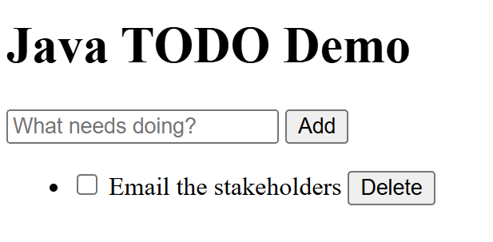

# Demo Recording Script — Java Spring Boot + Model Context Protocol (MCP) + Copilot

**Demo source:** [microsoft/github-copilot-java-mcp-demo](https://github.com/microsoft/github-copilot-java-mcp-demo)

> **Publication check:** Review every screenshot and screen recording for repository names, local paths, account names, notifications, and other identifying information. Redact or replace any exposed details before publishing.

> **Recording rule:** Treat each `Say` cell as a sequence of timed cues, not as one paragraph to read before the row. Say a sentence immediately before its matching action, perform that action, and then continue with the next sentence. The final sentence in each row should connect the result on screen to the next row. Where the `Do` column says to wait, let the take keep running; long waits are trimmed in the edit.

> **Control rule:** Use visible buttons, menus, and links for every demo action. Do not use keyboard shortcuts or function keys. Use the keyboard only to enter text into fields and prompts.

> **Step numbers:** Demo steps are numbered `episode.step`, so `3.2` is Episode 3, step 2. Use those numbers to call out the step you are on.

> **Paste rule:** The `Paste` column holds the exact text to copy for that step. Copy it and paste it instead of typing it, so the recording stays clean and the wording matches the narration. A `—` means the step needs no typed input.

## Episode 1 of 4 — Build and run your first Spring Boot app

### Intro — Talking head (~15s)

> How long does it take to go from a folder of Java files to a running web app? Two extensions, and the tooling does the rest, all driven from Visual Studio Code. Let’s jump right in.

**Do:** End on “let's jump right in,” then cut to screen share.

### Demo — Set up, build & run

**Prerequisites:** Clone the finished sample from the [GitHub repository](https://github.com/microsoft/github-copilot-java-mcp-demo) and open it in VS Code with Java 25 installed. Leave the **Extension Pack for Java** and the **Spring Boot Extension Pack** uninstalled, because this video installs them.

**Before recording:** Use a freshly cloned copy that has not been opened with the Java extensions before, so the project import is clearly visible. Trust the folder before the take so no trust prompt appears on camera. VS Code also shows a **Do you want to install the recommended extension** notification for Maven projects while the Java pack is missing; dismiss it beforehand so the take follows the scripted Extensions view path. Stop any running instance of the application, make sure port 8080 is free, and prepare a browser tab for http://localhost:8080. During the take, install both extension packs, but do not select **Download a new JDK...** — step 1.2 only points at that button.

**Pacing:** Announce each wait, then let the Java project import, the Maven build, and application startup finish. The Maven build prints a Mockito self-attach notice and dynamic-agent warnings, and startup prints three `BeanPostProcessorChecker` warnings about the MCP annotation scanner. All are expected; wait for **`BUILD SUCCESS`** and the started message instead of reacting to them.

| # | Where | Do | Say | Paste |
|---|-------|----|-----|-------|
| 1.1 | VS Code — Activity Bar → Extensions | Select the **Extensions** button in the Activity Bar. Search **"Extension Pack for Java"**, open its result, and select **Install**. Wait for the **Opening Java Projects** notification to appear and finish. Then show the new **Java Projects** and **Maven** views in the Explorer and the **Java: Ready** item in the Status Bar. | "We'll start with the sample provided in the description, cloned and already open in Visual Studio Code — right now it's just a folder of files. To follow along, all you'll need is a Java Development Kit, JDK for short. From the Activity Bar, we'll open Extensions, search for the Extension Pack for Java, and select Install. That one pack covers language support, debugging, Maven, and testing. It spots the project's `pom.xml` and starts importing, so let's wait for Opening Java Projects to finish. The Status Bar now reads Java: Ready, and the Explorer has gained Java Projects and Maven views. That import needs a JDK, so let's confirm which one it found." | `Extension Pack for Java` |
| 1.2 | VS Code menu → Command Palette | Select **View → Command Palette**, search for **"Java: Configure Java Runtime"**, and select that command from the results. On the **Project Settings** page, stay on **Classpath → JDK Runtime** and point to **JDK: JavaSE-25** and the install path below it, then to the **Download a new JDK...** button without selecting it. Close the tab without selecting **Apply Settings**. | "We'll open the Command Palette from the View menu, search for Java: Configure Java Runtime, and select it. That opens the Project Settings page, and the JDK Runtime tab is the part we want: it shows this project resolving to JavaSE-25, with the exact folder that JDK was installed to. If you don't have a JDK at all, the Download a new JDK button fetches one without leaving the editor. A JDK is already installed here, so we'll close this page. Java itself is covered, so now for the Spring side." | `Java: Configure Java Runtime` |
| 1.3 | VS Code — Extensions view | Return to the **Extensions** view. Search **"Spring Boot Extension Pack"**, open its result, and select **Install**. When the install finishes, show the new **Spring Boot Dashboard** icon in the Activity Bar. | "Back in Extensions, we'll search for the Spring Boot Extension Pack and install that one too. It brings Spring Boot Tools for Spring-aware editing of configuration files, and the Spring Boot Dashboard for running and managing the application. The Dashboard has just added its own icon to the Activity Bar, and we'll come back to it shortly. The tooling is complete now, so let's look at what it's reading." | `Spring Boot Extension Pack` |
| 1.4 | `pom.xml` | Open the root `pom.xml`. Point to the `spring-boot-starter-parent`, the `springboot-mcp-demo` artifact, the `java.version` property `25`, and the four starter dependencies. | "And this is the file it reads first. `pom.xml` is Maven's project definition: everything the app is built from. The Spring Boot parent sets the framework version, the coordinates name the project `springboot-mcp-demo`, and the Java version matches the JDK we just confirmed. Then come the four dependencies that decide what the app can actually do. Actuator adds health and monitoring endpoints. WebMVC, Spring Boot 4's name for the Spring Web starter, brings an embedded web server and request handling. Thymeleaf renders HTML pages on the server. And Spring AI's server starter publishes the app's operations over the Model Context Protocol, MCP for short. That's the skeleton; everything else is the Todo code written on top of it. Let's open that up." | — |
| 1.5 | Explorer | In the Explorer, expand **src** → **main**. Expand the compacted `java\com\example\tododemo` row to show its folders, then expand **resources** → **templates**. | "Under the base package `com.example.tododemo`, the code is split into small folders: model, repository, service, and web. The templates folder beside it holds the HTML page. There's also an mcp folder that publishes these same operations as AI tools, but the web flow is what we're building and running today. We'll go through these in the order a request travels, starting with the class that boots the whole thing." | — |
| 1.6 | `SpringbootMcpDemoApplication.java` | Open the class and show `@SpringBootApplication` and the `main` method. | "And this is it: one annotation and a main method. `@SpringBootApplication` tells Spring to scan this package and everything under it. When `main` runs, Spring Boot starts an embedded web server, finds the annotated classes below this one, creates a single instance of each, and connects them to each other. That's wiring you'd otherwise write by hand. The classes it finds are the next three files." | — |
| 1.7 | `Todo.java` → `TodoRepository.java` → `TodoService.java` | Open `Todo.java` and show its four fields. Open `TodoRepository.java` and show `@Repository`, the concurrent map, and `save` assigning the id. Open `TodoService.java` and show `@Service`, the constructor, and the `add` method. | "`Todo` is the data: an id, a title, whether it's completed, and when it was created. `TodoRepository` is where those live. It's marked `@Repository`, and it keeps them in a concurrent map rather than a database, so `save` here is what hands out the next id. `TodoService` is the layer everything else calls. It's marked `@Service`, and Spring passes the repository into its constructor, which is the dependency injection we just described. Its `add` method validates and trims the title, creates a `Todo` with no id yet, and saves it. So who calls that?" | — |
| 1.8 | `templates/index.html` → `TodoController.java` | In the template, show the add form's `action="/todos"` and its `title` input. Then open the controller and show `@GetMapping("/")`, the `@PostMapping("/todos")` method, `service.add(title)`, and `return "redirect:/"`. | "The page is plain HTML with a Thymeleaf loop over the list. Its add form posts to `/todos` with a single field named `title`. `TodoController` is on the receiving end. Its `@GetMapping` for the root path asks the service for every Todo and renders this template. And here's the match for that form: `@PostMapping` for `/todos` passes `title` straight to `service.add`, then redirects to the root, which re-renders the list with the new item. Browser, controller, service, repository, and back. That's the full round trip, so let's build it and watch it run." | — |
| 1.9 | VS Code — Explorer → Maven | Expand **springboot-mcp-demo → Lifecycle**, hover over **package**, select its **Run** button, and wait for **`BUILD SUCCESS`** in the **Maven-springboot-mcp-demo** terminal that opens. | "We'll open the Maven view, expand this project's Lifecycle goals, hover over `package`, and select its Run button. `package` compiles the code, runs the tests, and produces the runnable Jar, so it proves the whole project is sound rather than just that it compiles. This takes a moment, so we'll pick back up at BUILD SUCCESS." | — |
| 1.10 | VS Code — Activity Bar → Spring Boot Dashboard | Select the **Spring Boot Dashboard** icon in the Activity Bar. Find **springboot-mcp-demo**, select its **Run** action, and wait for the app to show as running. | "There's BUILD SUCCESS, so the code compiled and every test passed. Now, instead of running that Jar from a terminal, we'll use the Spring Boot Dashboard: we'll find `springboot-mcp-demo` in the list and select Run. Startup takes a few seconds, so we'll wait for it." | — |
| 1.11 | Spring Boot Dashboard → browser | Point to the app's running state and port in the Dashboard, then select its **Open In Browser** action to open http://localhost:8080. | "The Dashboard now shows it running, with port 8080 beside it, and that's the embedded server the WebMVC starter brought in. We'll select Open In Browser, which launches that address, so we can drive the exact path we just traced through the code." | — |
| 1.12 | Browser | Enter **Prepare the demo**, select **Add**, select that row's checkbox, then select its **Delete** button. | "Here's the page the controller rendered. We'll enter `Prepare the demo` and select Add, and that single click is the post to `/todos`, the redirect, and the re-rendered list. Now we'll select the checkbox on that row, which posts to the toggle endpoint and comes back checked. And we'll select Delete on the same row, which drops it from the map and re-renders without it. Add, complete, delete, all working end to end." | `Prepare the demo` |
| 1.13 | Spring Boot Dashboard | Return to the Dashboard and select the app's **Stop** action. | "That's the whole loop confirmed in a real browser. We'll go back to the Spring Boot Dashboard and select Stop to shut the process down cleanly, and because this app keeps its todos in memory, stopping it clears them too. That's a Spring Boot app set up, built, run, and verified, all driven from Visual Studio Code." | — |

**The running Todo web app:**

### Outro — Talking head (~25s)

> And there it is. We installed the Java and Spring extensions, watched them import the cloned project, and explored the finished Todo app from model to controller. Then we built it, ran it from the Spring Boot Dashboard, and verified its core browser flow. That took us from a plain folder of files to a working Spring Boot application, all driven from Visual Studio Code. What would you build first with Java and Spring Boot? Let us know in the comments. Thanks for watching, and happy building.

---

## Episode 2 of 4 — Debug and inspect a Spring Boot request

### Intro — Talking head (~15s)

> What happens between a click in the browser and the Java code that handles it? We’ll stop a real request in mid-air and read what it’s carrying, all driven from Visual Studio Code. Let’s jump right in.

**Do:** End on “let's jump right in,” then cut to screen share.

### Demo

**Prerequisites:** Clone the finished sample from the [GitHub repository](https://github.com/microsoft/github-copilot-java-mcp-demo) and open it in VS Code with Java 25, the Extension Pack for Java, and the Spring Boot Extension Pack installed.

**Before recording:** Stop the Spring Boot app, make sure port 8080 is free, clear any breakpoints left over from earlier takes, leave the Dashboard's **Endpoint Mappings** section on **Show Defined Endpoints**, close Copilot Chat, and hide any terminal or output content that exposes local paths, account details, or unrelated notifications.

**Shutdown warning:** On Debugger for Java 0.59.0, neither the Dashboard's **Stop** action nor the debug toolbar's stop ends a **Debug**-launched process — an open regression, [vscode-java-debug#1585](https://github.com/microsoft/vscode-java-debug/issues/1585). Shut the app down from its terminal as scripted in step 2.10. If a take is abandoned, free port 8080 before the next one: the leftover process also holds the JMX port the Dashboard uses for **Properties** and **Memory**, and the next launch then fails with a `Port already in use` agent error naming that JMX port rather than 8080.

| # | Where | Do | Say | Paste |
|---|-------|----|-----|-------|
| 2.1 | Editor — `TodoController.java` | Show the `addForm` method, then click the gutter to set a breakpoint on its `service.add(title)` line. | "We'll start with the sample provided in the description, a Todo app whose web form sends a title to `TodoController`. To follow along, you'll need a Java Development Kit, the Extension Pack for Java, and the Spring Boot Extension Pack, all installed here. In `addForm`, the controller passes that title to the shared service. We'll set a breakpoint on that call so the next add request pauses right where the web layer hands off to the application logic." | — |
| 2.2 | VS Code — Activity Bar → Spring Boot Dashboard | Select the **Spring Boot Dashboard** icon in the Activity Bar. Select the app's **Debug** action and wait for the debugger to connect. | "The breakpoint is ready. The Spring Boot Dashboard in the Activity Bar comes from that pack, and that's where we'll select Debug for the application. We'll wait for the debugger to connect before inspecting the live views it adds." | — |
| 2.3 | Spring Boot Dashboard → `TodoController.java` | Show the app's running debug state. In the Spring Boot Dashboard, point out the **Endpoint Mappings** and **Memory** sections listed below **Apps**. Then return to the controller and show the gray URL hints above its mappings. | "The Dashboard now shows the app running with the debugger attached. Below the app list are its endpoint mappings, and a memory section that only appears while a live process is attached. Back in the controller, Spring Boot Tools also adds gray URL hints above the mapped methods. We'll use the root hint to send a request that hits the breakpoint." | — |
| 2.4 | Editor → browser | Click the root URL hint, enter **Trace this request** in the form, and select **Add**. Wait for VS Code to stop at the breakpoint. | "We'll open the root page directly from the controller's URL hint. In the form, we'll enter `Trace this request` and select Add. That request should pause here in Visual Studio Code, just before the controller calls the service." | `Trace this request` |
| 2.5 | Debug toolbar + Variables panel | Expand **Local**, which is collapsed when execution pauses, and show `title` and its value. Select **Step Into** in the Debug toolbar to enter `TodoService.add`. Select **Step Over** once to execute the `Todo todo = ...` line, then expand the new `todo` entry to show its `id` is `null`. | "Execution has paused on the service call. In the Local variables, we'll find `title` and confirm that the controller received `Trace this request`. Next, we'll select Step Into in the Debug toolbar to move from the controller into `TodoService.add`, the shared method behind this operation. Step Over then executes the line that creates the `Todo`, and the new local carries the title, but its id is still null. The repository assigns that during save, so let's step back out and watch it arrive." | — |
| 2.6 | Debug toolbar + Variables panel | Select **Step Out** in the Debug toolbar to return to `addForm`. In **Local**, expand the new `→add()` entry. Its `id` reads `Long@` and a number until you select the **Click to expand** control beside it, which resolves the value — `1` on a clean take. Show that value alongside the same `title`. | "Step Out finishes the service method and returns to the controller, still inside `addForm`. Local now includes the value that came back from `add`, carrying the same title, and opening its id shows the number the repository assigned during save. That is the id the page will use for the toggle and delete actions on this row." | — |
| 2.7 | Debug toolbar → browser | Select **Continue** in the Debug toolbar, wait for the request to finish, and show **Trace this request** in the browser. Leave the debug session running. | "With the todo stored, the rest of the request can run, so we'll select Continue in the Debug toolbar. The controller redirects, and Thymeleaf, the app's server-side template engine, renders the refreshed list. When `Trace this request` appears in the browser, the end-to-end request is complete. We'll keep the debugger attached for two runtime checks." | — |
| 2.8 | Spring Boot Dashboard → **Endpoint Mappings** → browser | Expand **Endpoint Mappings**, select **Show All Endpoints** in that section's toolbar, then find `/actuator/health` — not the `/actuator/health/**` entry beside it — and select its **Open** action. In the browser, point to the `status` field showing `UP`; the response may also include a `groups` field. | "First, we'll expand Endpoint Mappings. It starts out listing only the endpoints this project defines, so we'll switch it to Show All Endpoints. That brings in the ones Spring Boot Actuator adds, the dependency that exposes health and monitoring endpoints. Now we'll select Open on `/actuator/health`. The `UP` status in the browser confirms that the running application is healthy right now. That's a single snapshot, so for a view that keeps updating, the Dashboard's Memory section is next." | — |
| 2.9 | Spring Boot Dashboard → **Memory** | Open **Memory** and show the live heap information updating. | "We'll open the Memory section. This view updates the application's heap information while the app keeps running under the debugger. That completes the runtime inspection, so we can shut the process down cleanly." | — |
| 2.10 | Terminal panel → Spring Boot Dashboard | In the **Terminal** panel, select the app's terminal, then select its **Kill Terminal** trash icon. Confirm the Dashboard no longer shows the app running, and that port 8080 is free. | "This application is running in its own terminal, so ending that terminal is what shuts it down. We'll select Kill Terminal, and the Java process stops with it and gives up port 8080. The Dashboard's running indicator clears once that process is gone. That wraps up the request trace and the runtime inspection." | — |

**Actuator health response from the running sample:**

**Spring Boot Dashboard Memory view:**

### Outro — Talking head (~25s)

> And there it is. We followed a browser request into `TodoController`, inspected its title, stepped into `TodoService`, and watched the completed request return to the page. Then we used the Spring Boot Dashboard to confirm the app’s health and monitor its live heap. That is how you inspect a running Spring Boot app instead of guessing at what it is doing, all driven from Visual Studio Code. What request would you trace first in your own application? Let us know in the comments. Thanks for watching, and happy building.

---

## Episode 3 of 4 — Expose your Java operations to Copilot with MCP

### Intro — Talking head (~15s)

> What if GitHub Copilot could call your own Java methods, not just write them? The Model Context Protocol turns them into tools Copilot can use, all driven from Visual Studio Code. Let’s jump right in.

**Do:** End on “let's jump right in,” then cut to screen share.

**Prerequisites:** Clone the finished sample from the [GitHub repository](https://github.com/microsoft/github-copilot-java-mcp-demo) and open it in VS Code with Java 25, the Extension Pack for Java, the Spring Boot Extension Pack, and GitHub Copilot installed and signed in. Allow MCP tool use when VS Code prompts for trust or confirmation.

**Before recording:** Make sure the five `todo-mcp` tools are disabled in Chat, stop the Spring Boot app and the `todo-mcp` connection, make sure port 8080 is free, and prepare a browser tab at http://localhost:8080. Keep the **Terminal** panel showing the app's log so `Registered tools: 5` is visible without scrolling. Startup prints three `BeanPostProcessorChecker` warnings above that line; they are expected and can stay on screen. Trust the repository and workspace before the take so only the MCP connection and tool confirmations described below can appear.

### Demo

| # | Where | Do | Say | Paste |
|---|-------|----|-----|-------|
| 3.1 | `pom.xml` | Show the `spring-ai-starter-mcp-server-webmvc` dependency. | "We'll start with the sample provided in the description, with GitHub Copilot signed in. To follow along, you'll also need a Java Development Kit, the Extension Pack for Java, and the Spring Boot Extension Pack, all installed here. The app already has working Todo operations, and we'll expose them as MCP tools. In `pom.xml`, we'll find Spring AI's WebMVC MCP server starter. That single dependency supplies everything the app needs to act as an MCP server. Now let's look at the Java methods the application publishes." | — |
| 3.2 | `mcp/TodoTools.java` | Show the class's `@Component`, the five `@McpTool` methods, an `@McpToolParam`, and each method's delegation to `TodoService`. | "`TodoTools` is a Spring component, so the MCP annotation scanner can discover it. We'll walk through its five `@McpTool` methods, from `list_todos` through `delete_todo`. Each annotation gives Copilot a tool name and description, and `@McpToolParam` describes required inputs such as a title or id. The method bodies don't duplicate the application logic; they delegate to the same `TodoService` used by the web page. Now those tools need an HTTP transport that Visual Studio Code can connect to." | — |
| 3.3 | `application.properties` | Highlight `spring.ai.mcp.server.protocol=STREAMABLE`. | "In `application.properties`, the key line sets the MCP server protocol to STREAMABLE. That setting publishes the modern Streamable HTTP endpoint at `/mcp`. Without it, this starter falls back to its older Server-Sent Events transport, and the `/mcp` endpoint isn't available. The dependency, tools, and transport are now configured, so we'll start the Java application." | — |
| 3.4 | VS Code — Activity Bar → Spring Boot Dashboard | Select the **Spring Boot Dashboard** icon in the Activity Bar. Find **springboot-mcp-demo**, select **Run**, and wait for startup. In the **Terminal** panel, show **`Registered tools: 5`** in the app's log. Leave the app running. | "We'll find `springboot-mcp-demo` in the Spring Boot Dashboard, the Activity Bar view that the Spring Boot Extension Pack adds, and select Run. Startup takes a few seconds, then we'll look in the terminal for `Registered tools: 5`. That message confirms Spring discovered every annotated method. The Java server is ready; the next step is to point Visual Studio Code at that endpoint." | — |
| 3.5 | `.vscode/mcp.json` | Show the `todo-mcp` server's `type` and `url`. Select its **Start** code-lens and wait until that code-lens reads **Running** with **5 tools**. | "This workspace's `.vscode/mcp.json` defines a server named `todo-mcp`. Its HTTP type and the URL `http://localhost:8080/mcp` target the application already running in the Dashboard. Now we'll select Start and wait for Visual Studio Code to connect and discover the five tools. This Start action connects an MCP client; it doesn't launch the Java process. With the connection running, we can make those tools available to Copilot." | — |
| 3.6 | Copilot Chat — Agent mode | Open the Chat tools picker, find `todo-mcp`, enable its five tools, and close the picker. | "We'll open Copilot Chat in Agent mode and open the tools picker. Under `todo-mcp`, we can see the same five tool names that Spring registered. We'll enable them and close the picker. Copilot can now call those operations, so we'll give it a task that needs two of them in sequence." | — |
| 3.7 | Copilot Chat — Agent mode | Enter *"Use the todo-mcp tools to add a todo called 'Email the stakeholders', then list all todos."* and select **Send**. If prompted, review the tool name and arguments before choosing **Allow Once**. Wait for the final response. | "We'll ask Copilot to use `todo-mcp` to add a Todo called `Email the stakeholders`, then list all Todos. Selecting Send may raise a confirmation, so we'll review the tool name and arguments before allowing it. The final response should contain the newly created item, but it's worth verifying in the web page as well." | `Use the todo-mcp tools to add a todo called 'Email the stakeholders', then list all todos.` |
| 3.8 | Copilot Chat → browser | In Chat, point to **Email the stakeholders** in the structured `list_todos` result. Then select **Refresh** in the prepared http://localhost:8080 browser tab and point to the same title in the Todo list. | "The structured tool result contains `Email the stakeholders`, so the MCP call did what we asked. We'll switch to the browser tab at localhost:8080 and select Refresh. The same title appears there because the MCP tools and the web page's controller both delegate to one service and one in-memory repository. That shared result completes the test, so we'll shut both sides down." | — |
| 3.9 | `.vscode/mcp.json` → Spring Boot Dashboard | Select **Stop** for `todo-mcp` in `.vscode/mcp.json`. Then select **Stop** for **springboot-mcp-demo** in the Dashboard and confirm it is no longer running. | "We'll return to `.vscode/mcp.json` and stop the `todo-mcp` connection first, while the server is still running. Then we'll return to the Spring Boot Dashboard and stop the Java application. Because its repository is in memory, stopping the process clears the Todo created during this demo. Both are stopped, and port 8080 is free." | — |

**Proof it works — the todo created *through MCP* appears in the web page, as the single new item a clean take produces:**

**Copilot Chat calling the `todo-mcp` tools — the `add_todo` call and its structured result:**

### Outro — Talking head (~20s)

> And there it is. We used Spring AI to expose Java operations as tools through the Model Context Protocol, connected those tools to GitHub Copilot, and kept the web page and Copilot using the same service. After a browser refresh, a change made through Copilot appears in the web page, all driven from Visual Studio Code. What part of your own Java application would you turn into a Copilot tool? Let us know in the comments. Thanks for watching, and happy building.

---

## Episode 4 of 4 — Let Copilot test your Spring Boot app with Playwright

### Intro — Talking head (~15s)

> Your tests are all green — but is the page actually working? We’ll give GitHub Copilot a real browser and let it find out, all driven from Visual Studio Code. Let’s jump right in.

**Do:** End on “let's jump right in,” then cut to screen share.

**Prerequisites:** Clone the finished sample from the [GitHub repository](https://github.com/microsoft/github-copilot-java-mcp-demo) and open it in a current version of VS Code with Java 25, the Extension Pack for Java, the Spring Boot Extension Pack, and GitHub Copilot installed and signed in. Allow MCP server installation and tool use when prompted.

**Before recording:** Use a VS Code profile where the Playwright MCP server is not yet installed so the **Install** action is guaranteed to appear. Confirm the `@mcp playwright` gallery result appears before the take; if it does not, add the server to `.vscode/mcp.json` and start it from there instead. Stop the Spring Boot app, free port 8080, and close any browser left from an earlier Playwright run. The Playwright browser opens as a real Chrome window showing an **unsupported command-line flag: --no-sandbox** infobar; dismiss it with its **×** as soon as it appears so it is not on screen during the browser steps.

### Demo

| # | Where | Do | Say | Paste |
|---|-------|----|-----|-------|
| 4.1 | VS Code — Activity Bar → Extensions | Select the **Extensions** button in the Activity Bar. Search **`@mcp playwright`** and open the Playwright MCP server result. Review its publisher and command configuration. Select **Install**, confirm trust for the server, and wait for its running status. | "We'll start with the sample provided in the description, with GitHub Copilot signed in. To follow along, you'll also need a Java Development Kit, the Extension Pack for Java, and the Spring Boot Extension Pack, all installed here. Copilot needs browser-control tools to test this Todo app's page through a real browser, so we'll open Extensions from the Activity Bar, search the MCP server gallery for `@mcp playwright`, and open the Playwright result. Before installing, we'll review the publisher and the command this server runs. We'll select Install, confirm we trust this server, and wait for its running status. With the browser tools in place, we'll look at the page elements they will target." | `@mcp playwright` |
| 4.2 | `templates/index.html` | Show `data-testid="new-todo-input"`, `data-testid="add-todo"`, `data-testid="todo-item"`, `th:attr="aria-label='Toggle ' + ${todo.title}"`, and `data-testid="delete-todo"` in the template. | "In `index.html`, the input, the add button, every row, and every delete button all carry stable test ids, and each checkbox builds an accessible `Toggle` label from that Todo's title. These ids identify the exact controls without depending on visual styling. Before we drive them from a browser, we'll confirm the existing Java tests still pass." | — |
| 4.3 | VS Code — Activity Bar → Testing | Select the **Testing** button in the Activity Bar, select **Run All Tests**, and wait until all Java tests pass. | "We'll open the Testing view and select Run All Tests. The unit and integration tests take a moment, so we'll continue when every test shows as passing. Those tests establish that the service and Spring web flow work underneath the page, but they don't click through the page the way a user would. For that, the browser tools need a live application." | — |
| 4.4 | VS Code — Activity Bar → Spring Boot Dashboard | Select the **Spring Boot Dashboard** icon in the Activity Bar. Find **springboot-mcp-demo**, select **Run**, and wait until the Dashboard shows it running on port 8080. | "We'll find `springboot-mcp-demo` in the Spring Boot Dashboard, the Activity Bar view that the Spring Boot Extension Pack adds, and select Run. Startup takes a few seconds, and the app then shows as running on port 8080. The app is live, so we can check that Playwright is ready." | — |
| 4.5 | Copilot Chat — Agent mode | Select **Agent** mode, open the tools picker, confirm the Playwright tools are listed and enabled, and close the picker. | "In Copilot Chat, we'll select Agent mode and open the tools picker. The Playwright tools discovered during installation are listed and enabled, so we'll close the picker. Copilot can now control a browser, but it still needs clear steps and a way to prove each one worked." | — |
| 4.6 | Copilot Chat — Agent mode | Enter *"Use the Playwright tools to open http://localhost:8080 and verify the page title is 'Java TODO Demo'. Add a todo called 'Verify the browser flow', find that todo's row, complete it and verify it is checked, then delete it and verify it is gone."* and select **Send**. If prompted, review the tool name and arguments before choosing **Allow Once**. | "We'll ask Copilot to open the local app and verify its title, add `Verify the browser flow`, find that exact row, complete it and verify its checkbox, then delete it and verify the text is gone. The prompt specifies both the actions and the assertions, so we'll select Send. If prompted, we'll review the tool name and arguments before allowing it. Copilot can then run through it while we watch the browser." | `Use the Playwright tools to open http://localhost:8080 and verify the page title is 'Java TODO Demo'. Add a todo called 'Verify the browser flow', find that todo's row, complete it and verify it is checked, then delete it and verify it is gone.` |
| 4.7 | Browser window (Playwright) | As Copilot works, show the page open at http://localhost:8080, the input filled with **Verify the browser flow**, the new row after **Add**, the row's checked checkbox after completion, and the row disappearing after deletion. | "The Playwright browser has opened the Java TODO Demo at localhost:8080. Copilot fills the input with `Verify the browser flow` and selects Add. That exact row is now on the page, so Copilot targets its checkbox and not another item. After the toggle the checkbox is checked, and deleting the row makes the title disappear. That's the journey; now let's look at the checks it actually ran, back in Chat." | — |
| 4.8 | Copilot Chat | Return to Chat. Review the completed Playwright tool calls and final response, confirming the page title, added text, checked state, deletion, and absence check. | "We'll review the completed tool calls rather than trusting only what we just watched in the browser. The trace shows that Playwright loaded `Java TODO Demo`, added the exact title, saw the checkbox was checked, deleted the row, and then found no matching text. Those checks prove the page reached each required state, so the test is finished." | — |
| 4.9 | Playwright browser → Spring Boot Dashboard | Close the Playwright browser window. Return to the Dashboard, select **Stop** for **springboot-mcp-demo**, and confirm it is no longer running. Leave the Playwright MCP server installed in the VS Code user profile. | "We'll close the Playwright browser window and return to the Spring Boot Dashboard. Then we'll select Stop for `springboot-mcp-demo` and confirm its running indicator clears. The application is shut down, while Playwright remains installed in the Visual Studio Code user profile for future Chat sessions." | — |

**Illustrative browser state during a Playwright run; the live Copilot tool calls are shown during the demo:**

### Outro — Talking head (~20s)

> And there it is. We connected Playwright to GitHub Copilot through the Model Context Protocol and had Copilot test the Spring Boot app in a real browser, all driven from Visual Studio Code. Combined with the unit and integration tests, that gives us confidence in both the code and the experience a user actually sees. What browser workflow would you ask Copilot to test in your own app? Let us know in the comments. Thanks for watching, and happy building.

---

## Resources (video descriptions / hand-off)

- **Demo source:** https://github.com/microsoft/github-copilot-java-mcp-demo
- **Extension Pack for Java** (Microsoft): https://marketplace.visualstudio.com/items?itemName=vscjava.vscode-java-pack
- **Spring Boot Extension Pack:** search “Spring Boot Extension Pack” in the VS Code Marketplace
- **Java in VS Code:** https://code.visualstudio.com/docs/languages/java
- **Spring Boot Actuator:** https://docs.spring.io/spring-boot/
- **Spring AI (Model Context Protocol server):** https://docs.spring.io/spring-ai/reference/
- **Model Context Protocol:** https://modelcontextprotocol.io
- **Model Context Protocol in Visual Studio Code:** https://code.visualstudio.com/docs/copilot/chat/mcp-servers
- **Playwright Model Context Protocol server:** https://github.com/microsoft/playwright-mcp
